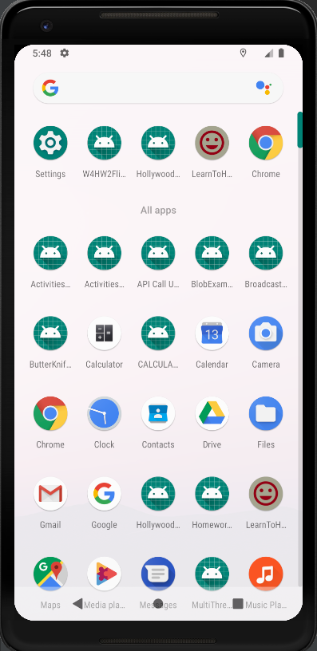
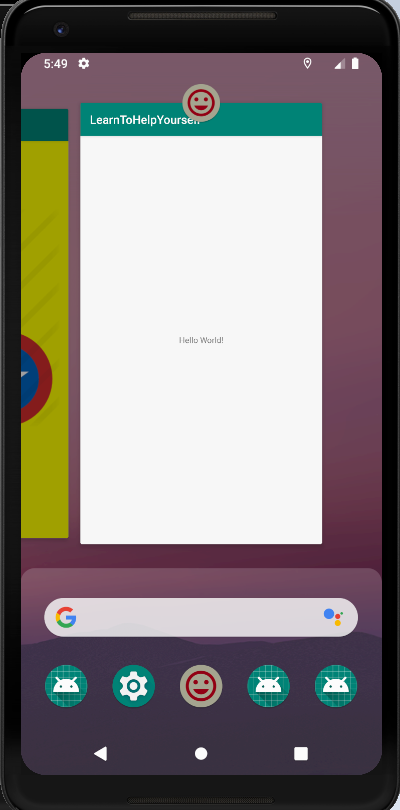
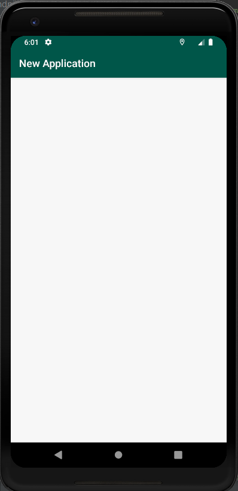
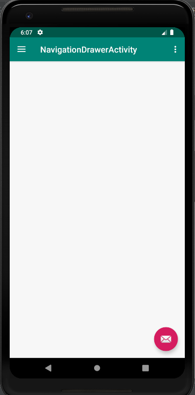

# LearnToHelpYourselfCodelab
Learn To Help Yourself Codelab

Overview file is attached as a word file: LearnToHelpYourselfOverview.docx

Instructions:

- Run the Android project.
- Create a new Virtual Device if not already. Then, choose Pixel 2 XL, then click OK.

